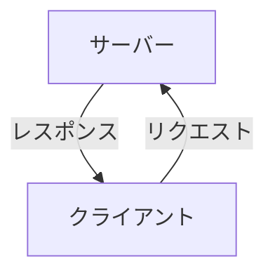
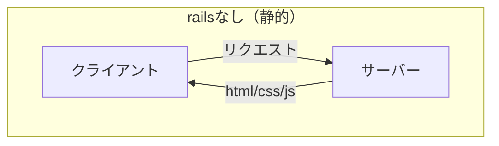

# チュートリアル  

## 導入  

あなたが本気なら、毎日3〜4時間の自習と、1時間の指導で1週間あれば独学可能になります。1か月すれば、動くだけのものは1人で作れるでしょう。  
AIの使用は禁止します。検索力はプログラミング力です。十分な力がついてから、作業短縮のためにAIを利用してください。  
Cを通ってるなら、難しいことはないです。道具の使い方を覚えた後に、原理を理解していきましょう。まずは道具をある程度1人で使えるようになってください。  
そして、ggるといろんなベストプラクティスがあります。しかし、全て無視しましょう。初学者はまず、「動けばいい」です。  

rails と html/css/js によってできるWEBサイトの違いは何だと思いますか？  
それを知るためにはサーバーとクライアントを理解する必要があります。  

### サーバー  

サーバーは、多くの場合はでかいパソコンです。パーソナルではないので、でかいコンピュータというべきでしょうか。  
個人用のPCよりも長い時間連続稼働できるようになっていたりします。  
サーバーの役割は、WEBの場合は計算をすることと、ファイルとデータを配布・操作することです。  

### クライアント  

クライアントというのは、システムにおいてはサーバーの対義語です。  
実態はSecurePCなどのようなパーソナルコンピューターであることが多いです。  
クライアントの役割は、サーバーに対して要求することです。  
クライアントは、サーバーに対して計算の要求をしたり、ファイルやデータを要求します。  
この要求を「リクエスト」といいます
反対に、サーバーが情報を配布することを「レスポンス」といいます

### rails を使うと何ができるようになる？  

サーバーは計算や、ファイルやデータの配布・操作ができます。  
このうち、html/css/js では、ファイルの配布しかできません。  
railsを使うことで、計算や、データの配布・操作ができるようになります。    

### 環境と最初のプログラミング  

ruby と railsが動作する環境を構築します。  

### 動作確認  

ruby(irb)で対話的に動作を確認します。  

### ちょっとした脳トレ(思い出そう！)  

基本的なコーディング機能を思い出してみましょう。
変数
データの種類
演算子
メソッド
ユーザー定義メソッド
if文
ループ処理
配列ループ処理

　背景の技術スタックと、原理を後回しにして良い理由(低レイヤーはすごいが、高レイヤーは低レイヤーの実装を知らずに使える作り。低レイヤーはアセンブラを意識しないし、アセンブラは機械語を意識しない…ということになっている)

　作るものを決める

　railsチュートリアルをやってみる

　デバッガとデバッグ

　gitlabに挙げてみよう(step4先取り)

　　機密情報を上げないようにしよう

ロードマップ(目指すところ次第でどこまでやるか違います。オススメはチーム開発の壁までやること。趣味なら個人開発の壁で十分！ただ、長くやるならいずれはstep4は知るべきかな)

step1(0〜100時間)

　作りたいものを作ろう(今回はあおいが決める)

　　作りたいものを細かく切り分けて説明しよう

　　一番小さな画面と機能を作る

　　CRUDを作ろう

　　サーバ側の拡張機能を作る

　　フロント側の拡張機能を作る

　カスタマイズの方法を知ろう

　生ログイン機能を作ろう

　　ユーザーtable

　　認証情報table　

step2(100〜300時間)

自分が作りたいものを作ってみよう

　好きな方法で

　　単に画面をつくる？(静的web)

　　論理演算機を作る？(サーバ側)

　　情報を返すだけの機能を作る？(API)

ユーザー視点で作ってみよう

　ユーザーが喜ぶ機能を考えよう

　ユーザーのために考え抜いて最小を作ろう

　ユーザーに試してもらおう

　エンハンス開発で改善しよう

　ユーザーから褒められよう

　リリースしてみよう

　　最低限の環境と最低限のセキュリティ

　　ユーザーの動きをトレースしよう

　　ユーザーに小さなアンケートをしてみよう

　　googleアナリティクスでアクセス追跡

　　google insightでパフォーマンス計測

　　a/bテスト

===== 個人開発の壁 =====

step3(300時間〜 /300時間)

効率のいいプログラミングを知ろう

　　dry原則

　　バージョン管理とgithub(gitlab)

　　オブジェクト指向

　　テスト駆動開発

　　オブジェクト指向の否定

　　ドメイン駆動開発

　設計

　　プログラミング・アーキテクチャ

　　フロント・APIアーキテクチャ

　　オニオンアーキテクチャ

　　メタプログラミング

　　インフラ構成と冗長化

　　静的ファイルの分離

　　分散アーキテクチャ

他のフレームワーク(言語)を試してみよう

　next.js(javascript)

　django(python)

step4(300時間〜 /100時間)

動けばいいを脱却して、使えるアプリの作り方を学びましょう

堅牢で実用的なアプリを作ろう

　データ設計

　データ駆動開発

　テストコード

　異常系テストという概念

　単体テストと結合テスト

　テストパターンの種類

　画面側(e2e)テスト(たいていのバグではデータは破壊されないはずだが、UXを損なうので売上に直結！)

　エラーハンドリング

　CI/CD(github circleCI jenkinsなど。自動テストも)

　疎結合(関心の分離)

　並列処理(排他制御)

　楽観ロックと悲観ロック

===== チーム開発の壁 =====

step5 (700時間〜  / 500時間)

原理を理解しよう

　フレームワークを理解しよう

　(ActionPackなど。railsの基本機能はどのように動くか？)

　周辺知識を理解しよう

　　一般的なhttp or https 通信の実態

　　通信プロトコル

　　ネットワーク

　　セキュリティレイヤーと多層防御

　　webアプリ層が意識すべきセキュリティ

　　ORMとSQLについて

step6(300時間〜 /200時間)

技術スタックを増やしてみよう

　js(react.js node.js 今のwebの流行)

　python3(標準で実行環境ありがち)

　java(職業PG目指すならSI案件入りやすい)

　swift(iosアプリ向け。mac必須)

　rust(なんでもできる。ナウい。ちょい習熟がむずい)

　.net(C# いつ使うかわからんが、特定領域ではよく使うらしい。生は触ったことない。unity 用と見做してる)

　shell(Linuxなら動く。ただしbash以外で同じ挙動とは言ってない。まともにメタプログラミングできないのでアプリにはならない)

ゲームプログラミングをしてみよう

　unity(unity  C#)

===== シニアレベルの壁 =====

step7(1000時間〜 / 500時間)

システム開発のプロになろう

　ベンダー最適をしる

　機能要件/非機能要件

　エンハンス開発体制

　保守開発体制

　インフラ構築

　運用を意識する

　ログ設計

　監視設計

　運用設計

　運用自動化

　ベンチマークとパフォーマンス改善

step8

低レイヤーに触れよう(ここは僕も入門中)

　C++/C

　アセンブラ

　CPUについて

　Linuxカーネルについて

　webサーバを書いてみる

===== 独立の壁 =====

step9(覚悟と挑戦)

起業の夢を見るなら

前提として、実際にユーザーからお金を取れるアプリを作ってみて、売上を立てること。最低それさえできれば、あとは覚悟次第。

組織論

経営論

営業論

人脈作り

資金調達

ユーザーだけを見つめる

覚悟　

理念　

